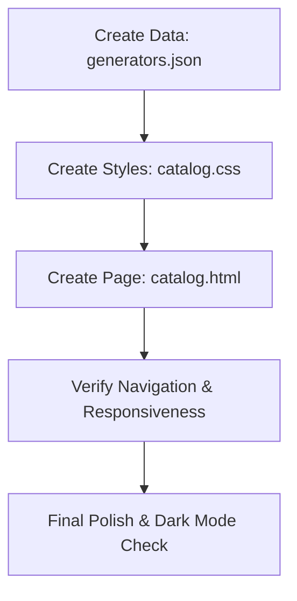

# Detailed Plan: Rental Catalog Implementation

This plan details the implementation of a new "Rental Catalog" page, providing a structured product showcase for generators.

## 1. Data Management

- **File**: `src/_data/generators.json`
- **Content**: An array of generator objects. Each object will include:
    - `id`: Unique identifier (e.g., "gen-20kw-diesel")
    - `name`: Display name (e.g., "20kW Diesel Generator")
    - `power`: Power rating (e.g., "20kW")
    - `fuel`: Fuel type (e.g., "Diesel")
    - `phase`: Electrical phase (e.g., "Single / Three")
    - `voltage`: Voltage options (e.g., "120/240V")
    - `image`: Path to the product image (e.g., "/images/generators/gen-20kw.png")
    - `features`: Array of key features (e.g., ["Sound Attenuated", "Trailer Mounted"])

## 2. Visual Design & Styling

- **File**: `src/css/catalog.css`
- **Sections**:
    - **Catalog Hero**: Uses the standard interior hero style (`#int-hero`) but with a catalog-specific background image.
    - **Product Grid**: A responsive grid layout (CSS Grid) that adjusts from 1 column on mobile to 3 columns on desktop.
    - **Product Card**:
        - Image container with hover effects.
        - Specification list (Power, Fuel, Phase, etc.) using a clean, icon-based or labeled layout.
        - "View Details" or "Request Quote" button styled consistently with the site's primary buttons.
    - **Dark Mode**: Explicit overrides to ensure high contrast and readability in dark mode.

## 3. Page Structure

- **File**: `src/pages/catalog.html`
- **Front Matter**:
    - `layout: "base.html"`
    - `eleventyNavigation`: key "Catalog", order 800.
- **Body**:
    - Hero section with title "Rental Generator Catalog".
    - Main section with a `.cs-container` for the grid.
    - Liquid/Nunjucks loop: `` to generate cards.

## 4. Navigation & Integration

- **Header**: The `src/_includes/header.html` already uses `eleventyNavigation`, so adding the front matter to `catalog.html` will automatically add it to the main nav.
- **Assets**: Placeholder images will be used initially, or existing images from `src/images/` if applicable.

## 5. Implementation Steps




### Example Card Structure (HTML Snippet)

```html
<div class="catalog-card">
    <div class="card-image">
        
    </div>
    <div class="card-content">
        <h3>{{ gen.name }}</h3>
        <ul class="specs">
            <li><strong>Power:</strong> {{ gen.power }}</li>
            <li><strong>Fuel:</strong> {{ gen.fuel }}</li>
            <!-- ... other specs ... -->
        </ul>
        <a href="/contact/" class="cs-button-solid">Request Quote</a>
    </div>
</div>

```