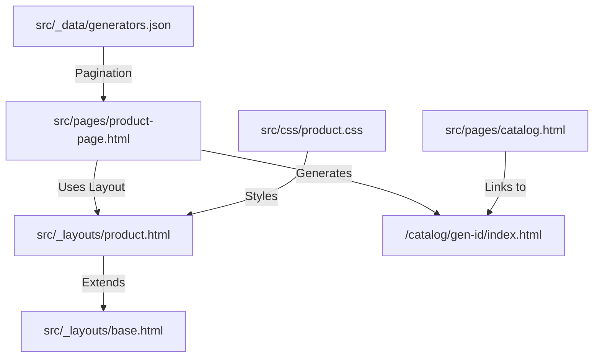

# Plan: Rental Product Pages Implementation

This plan outlines the creation of individual product pages for the rental generator catalog. We will use Eleventy's pagination feature to generate pages from `src/_data/generators.json`.

## Phase 1: Data Architecture & Template Scaffolding

**Focus**: Preparing the data and the structural foundation.

- **Data Enhancement**: Update [`src/_data/generators.json`](src/_data/generators.json) to include:
    - `description`: A paragraph for the "Equipment Description" section.
    - `specs`: An object containing key-value pairs for technical specifications (e.g., `Power`, `Engine`, `Mobility`).
    - `keyFeatures`: An array of strings for the feature checklist.
    - `status`: String (e.g., "Available Now").
    - `category`: String (e.g., "EMERGENCY").
- **Layout Creation**: Create [`src/_layouts/product.html`](src/_layouts/product.html):
    - Extend [`src/_layouts/base.html`](src/_layouts/base.html).
    - Define blocks for product-specific scripts and styles.
    - Include breadcrumb logic (`Catalog / {{ gen.name }}`).
- **Pagination Template**: Create [`src/pages/product-page.html`](src/pages/product-page.html):
    - Set up frontmatter for Eleventy pagination using `generators` data.
    - Set `permalink` to `/catalog/{{ gen.id }}/index.html`.
    - Map data fields to the layout.

## Phase 2: Visual Implementation & Component Styling

**Focus**: Crafting the UI to match the reference images exactly.

- **Global Styles**: Create [`src/css/product.css`](src/css/product.css) and link it in the template.
- **Header Section**:
    - Style the product title (large, bold, uppercase).
    - Implement the "Call for Quote" badge with the "STARTING FROM" label.
    - Add the status indicator (green dot) and category tag.
- **Main Content Layout**:
    - Use a 2-column grid for desktop (Image/Tabs on left, Form/Assistance on right).
    - **Product Image**: Large rounded corners, object-fit contain.
    - **Quote Form**: Sticky sidebar card with orange border-top, input fields, and orange submit button.
- **Interactive Tabs**:
    - Implement "Overview" and "Specifications" tabs using CSS `:checked` or simple JS.
    - **Overview Tab**: Show "Equipment Description" and "Key Features" (2-column checklist with green checkmarks).
    - **Specifications Tab**: Show a grid of technical specs with icons (e.g., material symbols for Power, Engine).
- **Sidebar Components**:
    - "Need Immediate Assistance?" card with dark background and gold phone number.

## Phase 3: Integration, Logic & Polish

**Focus**: Connectivity, interactivity, and final quality checks.

- **Catalog Linking**: Update [`src/pages/catalog.html`](src/pages/catalog.html):
    - Change the "Request Quote" button to "View Details" (or keep both) and link to `/catalog/{{ gen.id }}/`.
- **Form Logic**:
    - Add a script to [`src/pages/product-page.html`](src/pages/product-page.html) to pre-populate the "How can we help?" textarea with: `"I am interested in renting the {{ gen.name }}. Please provide availability and pricing."`
- **Dark Mode Support**:
    - Add `@media (prefers-color-scheme: dark)` or `body.dark-mode` overrides in `product.css`.
    - Ensure the form inputs and tab content remain legible.
- **Responsive Audit**:
    - Stack the columns on mobile (Header -> Image -> Form -> Tabs).
    - Ensure the "Call for Quote" badge scales correctly.

## Mermaid Diagram of Data Flow

